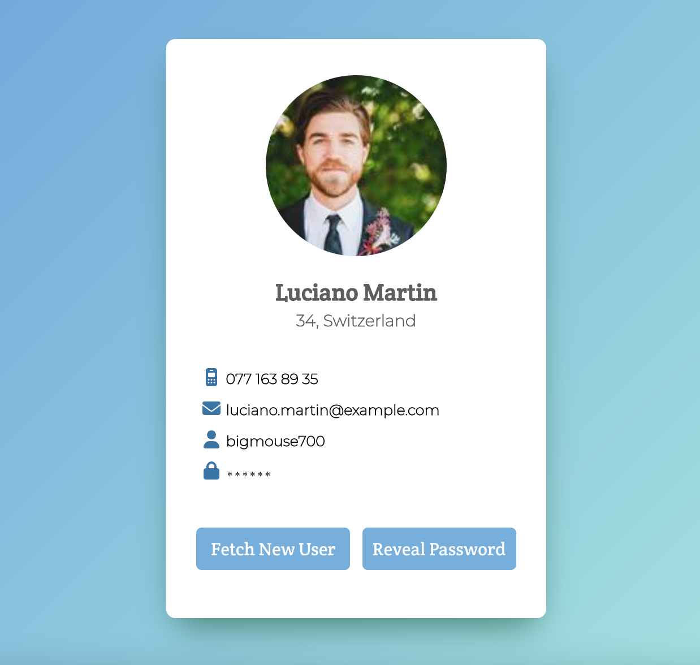

# Dynamic User Card

I took a technical test for an interview as a base to build this simple project with a card component that displays user's basic info fetched from a public API.

## Live Demo

[Try the User Card Here](https://soniagisel.github.io/user-card/)

## Description

### What does the app do?

This is a simple interactive user card that displays basic information from users such as contact info and a user and password (showing such data was part of the test).

You can click on `Fetch New User` to change the current user to another one randomly chosen.

When clicking the `Show/Hide Password` button, the icon next to the password will show an open or closed lock to match the action.

If the API fails the card won't show up and instead an error message will appear with a button to try again.

When the app is loading it'll show a spinner as well as when it's fetching another user, but it might be barely noticeable while using WiFi.

I suggest that, to play a little more with the app, you can set the `Network` to use `Slow 3G`. If so, you'll also notice that both buttons are blocked when fething another user and unblocked when all the data is available.

### The information displayed is the folowing:
- Profile Picture
- Age and Country
- Email: you can click on it and it'll allow you to send an email to that address right away.
- Phone: very usefull if used from a phone, you can click it and call to that number with the app of your choice.
- User
- Password

> All the data is provided by the [Random User API](https://randomuser.me/api/)

### Technologies

- Create React App
- React Hooks
- Redux Toolkit
- CSS Modules
- Sass
- Typescript
- ES6
- Fontawesome Icons
- Public RESTful API

### How I chose the technologies

`Create React App` and the `public API` where a requirement for the test, but I got the freedom to choose the other technologies, some of them added after the challenge.

Some of them where chosen because it's the standard I use to work with, like Hooks, Functional Components,ES6, CSS Modules with Sass and Fontawesome Icons.

I decided to add Typescript because I wanted to add an extra challenge and from now on I decided to add it to all my projects because it's my intention to be proficent in it. I think Typescript can be a great tool to help keep consistency, lead to less errors while coding and make things more predictable across the whole application.

I also decided to try `createApi` a feature of [RTK Query](https://redux-toolkit.js.org/rtk-query/overview) from `Redux Toolkit`. Originally I was using `Redux` to manage the state and the idea was to implement `extraReducers` with `asyncThunks` to be able to perform different actions for when a request was `pending` or `fulfulled` but `createApi` appeared as an option to handle the same things using less code and in just one service that makes the request, manages the different states, saves the data in a reducer and exposes different values that can be used to take action in case the request returns `isSuccess`, `isError` or improve the UX with `isLoading` or `isFetching`.

### Challenges I faced

During the development of this project I faced different challenges, specially related to the implementation of new stuff or project configuration.

Implementing `createApi` from scratch just by reading the [RTK Query Docs](https://redux-toolkit.js.org/rtk-query/overview) was a a bit chalenging because I it was the first time I read about it and decided to use it so I had to understand how it works. To do so I try to research some examples but the ones I found where very custom and large, for exaple due to the use of `Axios`. I wanted to keep it simple so I decided to follow just the docs. My implementation was a bit different than the ones in the examples so I had to adapt a few things but it turned out to be even simpler and I was able to quickly make it work.

Also adding `Typescript` to an existing project required me to add a lot of new `npm` packages and config files. Adding them was not as stright forward as it looked in the docs as I got different errors but doing some researches I was able to understand how to adjust the configuration I required, get rid of the errors and leave the app running with no issues.

The last new challenge was with GitHub Pages as I decided to deploy the project to bring it to life and make it available for anyone to see it and play with it. Understanding how GitHub Pages works in general with the different options for creating a portfolio or a project page was simple, but it was a bit tricky to find a good explanation on how to deploy a project created with `Create React App` as it required to install a few packages and add custom scripts.

## How to Install and Run the User Card Project

1. Download or fork the project to your local workspace.
2. From the project root run `npm install`
3. Run `npm start` and after a few secs you should see the app running right away in your browser.
4. Have fun!